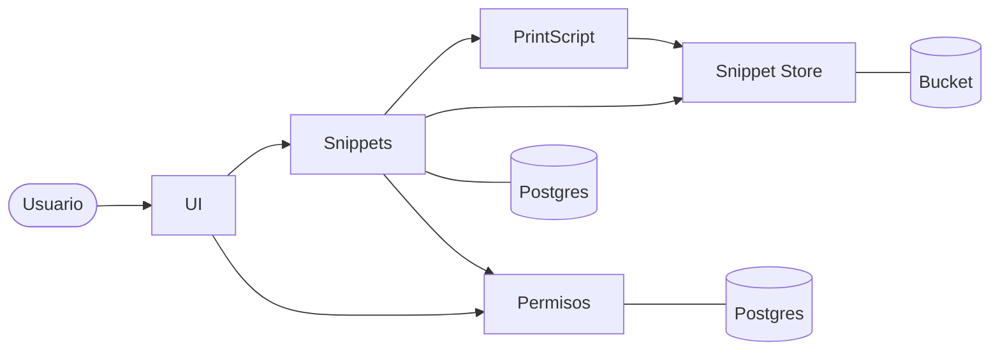

# PPC · Ingeniería de Sistemas

**Universidad Austral · 2026**

Diseño y construcción de software en equipo: un lenguaje de programación propio y una plataforma de servicios para trabajar con él.

---

## Proyectos

### PrintScript

Intérprete de un subconjunto de TypeScript, escrito en Kotlin. Lee el código en streaming, informa cada error con su línea y columna, y se distribuye como un conjunto de librerías publicadas en GitHub Packages.

| Repositorio | Descripción |
|---|---|
| [printscript](https://github.com/PPC-INGSIS/printscript) | Lexer, parser, intérprete, formatter y analyzer, más una CLI para ejecutar, validar, formatear y analizar |

### Snippet Searcher

Plataforma web para guardar, compartir, validar y ejecutar snippets de código. Está construida como un conjunto de servicios independientes: cada uno tiene su propia base de datos y se comunica con los demás por HTTP.

| Repositorio | Descripción | Estado |
|---|---|---|
| [snippet-service](https://github.com/PPC-INGSIS/snippet-service) | Puerta de entrada de todo lo que es snippet: datos, tests y resultados | En desarrollo |
| [workflow](https://github.com/PPC-INGSIS/workflow) | Workflows reusables de GitHub Actions, compartidos por todos los servicios | Activo |
| [infraestructura](https://github.com/PPC-INGSIS/infraestructura) | Configuración para levantar el sistema completo con Docker | En desarrollo |

## Arquitectura de Snippet Searcher

| Servicio | Responsabilidad |
|---|---|
| **Snippets** | Recibe los pedidos del usuario y guarda los datos de cada snippet. No ejecuta código |
| **Permisos** | Responde quién puede ver o editar cada recurso |
| **PrintScript** | Valida, formatea, analiza y ejecuta, usando las librerías del lenguaje |
| **Snippet Store** | Guarda y entrega el código de los snippets |

Los servicios se separan donde las necesidades son distintas. Ejecutar código de terceros tiene otro riesgo y otra carga que guardar datos, y por eso vive en su propio servicio: si falla, el resto de la plataforma sigue funcionando.

## Cómo trabajamos

- **Cada cambio pasa por un pull request**, y se integra solo con la verificación automática aprobada.
- **Calidad verificada en cada build:** formato con ktlint, análisis estático con detekt y cobertura mínima de tests del 80%.
- **Tests contra dependencias reales:** cada corrida levanta su propia base de datos con Testcontainers.
- **Cambios de base de datos versionados** con migraciones.
- **Configuración fuera del código:** los valores de cada entorno se definen por variables, y los secretos nunca se suben al repositorio.

## Equipo

<!-- Completar con los integrantes -->
| Integrante | GitHub |
|---|---|
| Nombre Apellido | [@usuario](https://github.com/usuario) |
| Nombre Apellido | [@usuario](https://github.com/usuario) |
| Nombre Apellido | [@usuario](https://github.com/usuario) |
